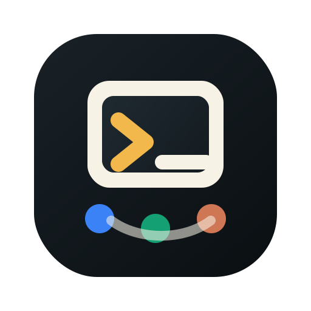
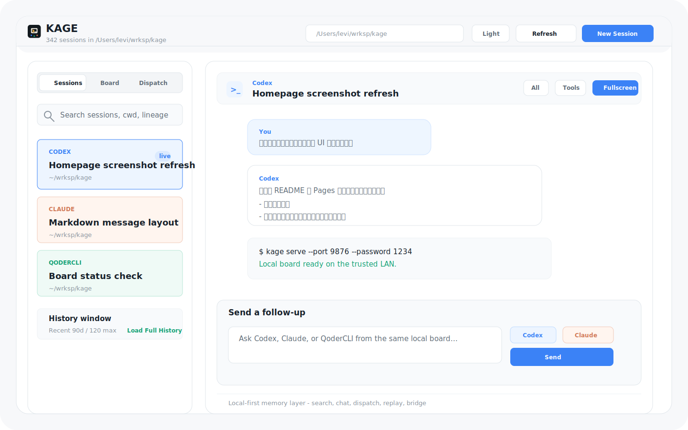
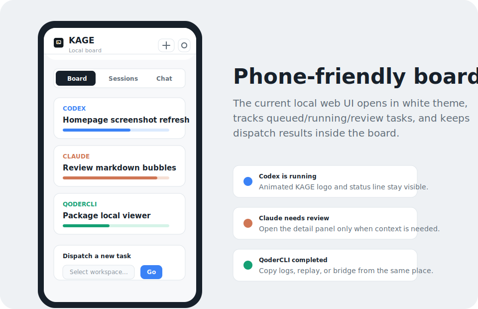

<p align="center">
  
</p>

<h1 align="center">KAGE</h1>

<p align="center">
  Local memory for Claude Code, Codex, QoderCLI, and QoderWork.
</p>

[](https://github.com/farmcan/kage/actions/workflows/ci.yml)
[](LICENSE)
[](app/)

KAGE is the local memory layer for the AI coding tools you already run. Find the session where useful work happened, replay it, fork it, or bridge it into another agent's native resume format without uploading transcript content.

> Your coding agents already have memory. KAGE makes it searchable, actionable, and local-first.

Homepage: <https://farmcan.github.io/kage/>

Latest release: [KAGE v0.1.17](https://github.com/farmcan/kage/releases/tag/v0.1.17)

## Why Star KAGE

- **One local surface for many agents.** Claude Code, Codex, QoderCLI, and QoderWork keep separate transcript stores; KAGE makes them feel like one workspace.
- **Task board for local agent runs.** Dispatch one-off tasks, track queued/running/review/completed states, and keep the result visible without losing the session list.
- **Mobile agent monitor.** `kage serve` lets you see what local Claude, Codex, and Qoder runs are doing from your phone, with sessions first and dispatch as a secondary action.
- **Session memory without hosted indexing.** Transcript content stays on disk by default; KAGE reads local files and launches local tools.
- **Bridge and replay when context matters.** Move useful work between agents or create a local HTML story replay for review.

## What Works Today

| Surface | What you can do |
|---|---|
| macOS desktop | Browse project sessions, filter agents, inspect messages, start new sessions, launch Terminal.app, run resume/fork/bridge/replay actions. |
| CLI | Search, list, bridge, fork, replay, clean, generate actions, and script everything through `kage`. |
| Local web | Watch running agents, browse sessions, review transcripts, and open the task board with `kage serve --port 9876 --password <pin>`. |
| Local dispatch | Send prompts to Claude Code, Codex, or QoderCLI as new tasks, then review and complete them from the board. |

Remote-control tools keep today's agent run moving. KAGE helps you recover, reuse, and branch yesterday's useful context.

Star KAGE if you want AI coding sessions to become searchable, reusable local project memory instead of forgotten JSONL files.

KAGE is intentionally **not** a hosted coding agent, cloud transcript index, or terminal replacement. It is the local memory and control layer around the agents you already trust.

## Screenshots

Start with the readable desktop and mobile previews to see the main KAGE surfaces.





The flow demo below shows search-to-bridge in motion.


## Try It In 60 Seconds

Before trying it, KAGE is most useful if you already have at least one Claude Code, Codex, QoderCLI, or QoderWork session on this machine. If you do not, open the desktop app and click `Explore Demo` to inspect sanitized local sample sessions first.

Install the CLI:

```bash
curl -fsSL https://raw.githubusercontent.com/farmcan/kage/main/install.sh | bash
```

Check what KAGE can see:

```bash
kage doctor
kage sessions --since 90d --limit 120
kage sessions --include-subdirs
kage search "auth"
```

Optionally download the macOS desktop app:

```text
https://github.com/farmcan/kage/releases/download/v0.1.17/KAGE-0.1.17.dmg
```

The desktop app is currently unsigned in CI.
For trusted installs in local testing, use right-click `Open`, or export signing/notarization env vars for `app/package.sh` before publishing:

```bash
KAGE_CODESIGN_IDENTITY="Developer ID Application: Your Team" \
KAGE_NOTARY_PROFILE="kage-notary" \
(cd app && ./package.sh)
```

Open the local mobile agent monitor:

```bash
kage serve --port 9876 --password 1234
```

Open the printed LAN URL from a phone or tablet on the same trusted network to see what your agents are doing. Add `--read-only` when you only want to monitor sessions without dispatching local agent runs.

Bridge a useful session:

```bash
kage c2x
```

From the desktop app or serve UI, use `New Session` / `Dispatch` to start a fresh Codex, Claude Code, or QoderCLI run in the selected working directory.

## Use KAGE If

- You use more than one AI coding agent and want context to move with you.
- You remember a useful plan, bug, or implementation detail, but not which local session contains it.
- You want transcript search, replay, and cleanup without sending everything to a hosted service.
- You want a desktop workspace, mobile agent monitor, task board, and scriptable CLI actions for automation.

## Skip It For Now If

- You only use one coding agent and never revisit old sessions.
- You need a signed and notarized macOS installer today. The current DMG is unsigned while [#34](https://github.com/farmcan/kage/issues/34) is open.
- You expect hosted cloud sync, team sharing, or a public remote relay today. Those are future directions, not shipped product.

Build and open the macOS desktop app from a local checkout:

```bash
swift build --package-path app
(cd app && ./bundle.sh)
open app/.build/release/KAGE.app
```

## How It Differs

| Tool | Best At | Where KAGE Fits |
|---|---|---|
| Codex / Claude native resume | Continuing one agent's own sessions | Search, fork, replay, and bridge sessions across multiple agent stores. |
| Warp or a normal terminal | Running commands and interactive shells | KAGE is the session memory layer; it can launch agents, but it is not trying to be your terminal. |
| Raw transcript scripts | One-off parsing or export jobs | KAGE keeps a stable CLI JSON contract and a desktop app over the same behavior. |
| Cloud knowledge tools | Team sync and hosted search | KAGE keeps transcript content local by default. |

## Why It Exists

KAGE is built around four practical workflows.

1. Run local agents from one board.
Dispatch prompts to Claude Code, Codex, or QoderCLI, then review the result before marking the task complete.

2. Fork a conversation and keep the useful context.
You can branch an existing session, trim it, append one new user message, and continue without rebuilding context from scratch.

3. Bridge between agents.
You can move a session between tools like `Claude -> Codex` or `Codex -> Claude` and keep working with a native session file instead of a pasted transcript.

4. Browse local agent memory.
The desktop app and local web UI give you a project-scoped session list, search, recent messages, and per-session actions without leaving the local machine.

## Core Examples

Bridge a Claude session into Codex:

```bash
kage c2x
```

Bridge a Codex session into Claude:

```bash
kage x2c
```

Fork the current Codex session into a new Codex session:

```bash
kage x2x
```

Fork the current Claude session into a new Claude session:

```bash
kage c2c
```

For same-agent forks, KAGE also prints first-party guidance when the agent already has native support. For example, `c2c` points to `cd <cwd> && claude --resume <source-session-id> --fork-session`, and `x2x` points to `codex fork <source-session-id>`.

Fork or trim before exporting:

```bash
kage claude qodercli --split-recent 1 --out ./tmp/split.jsonl
kage claude qodercli --fork "另外开一个分支，去做 session split" --out ./tmp/fork.jsonl
```

## What It Supports

| Source | Target | Default Export | Resume Hint |
|---|---|---|---|
| `codex` | `claude` | `claude-session` | `cd <cwd> && claude --resume ...` |
| `claude` | `codex` | `codex-session` | `codex resume ...` |
| `claude` | `claude` | `claude-session` fork | `cd <cwd> && claude --resume ...` |
| `codex` | `codex` | `codex-session` fork | `codex resume ...` |
| `qodercli` | `codex` | `codex-session` | `codex resume ...` |
| `qodercli` | `claude` | `claude-session` | `cd <cwd> && claude --resume ...` |
| `qodercli` | `qodercli` | `qoder-session` fork | `qodercli --cwd ... --resume ...` |
| `qoderwork` | `codex` | `codex-session` | `codex resume ...` |
| `qoderwork` | `claude` | `claude-session` | `cd <cwd> && claude --resume ...` |
| `qoderwork` | `qodercli` | `qoder-session` | `qodercli --cwd ... --resume ...` |
| `codex` | `qodercli` | `qoder-session` | `qodercli --cwd ... --resume ...` |
| `claude` | `qodercli` | `qoder-session` | `qodercli --cwd ... --resume ...` |

## Install

### macOS Desktop App

Download the v0.1.17 DMG from GitHub Releases:

```text
https://github.com/farmcan/kage/releases/download/v0.1.17/KAGE-0.1.17.dmg
```

The DMG is unsigned for now. If macOS blocks the first launch, right-click `KAGE.app`, choose `Open`, then confirm.

### CLI

```bash
curl -fsSL https://raw.githubusercontent.com/farmcan/kage/main/install.sh | bash
```

Then use:

```bash
kage c2x
kage update
```

To upgrade a previous install from this script, run the same install command again. The installer removes the old `agent-session-bridge` global package if it is present, then reinstalls KAGE from the latest `main` tarball.

### Local Development

```bash
npm install
npm link
```

Build the experimental desktop app:

```bash
swift build --package-path app
swift run --package-path app kage-contract-smoke
(cd app && ./bundle.sh)
open app/.build/release/KAGE.app
```

The app opens a desktop session workspace and also keeps a menu bar item for quick checks.

## Quick Start

```bash
kage c2x
kage doctor
kage sessions --json
kage search "resume"
kage actions
kage c2c
kage c2v
kage x2c
kage x2x
kage x2v
kage c
kage q
kage x
kage q2q
kage q2x
kage q2c
kage q2v
kage x2q
kage c2q
```

## Practical Test

The most convincing way to validate KAGE is to resume a real session in one agent, export it, then resume it in another.

For example, start from a Claude session:

```text
Resume this session with:
cd /path/to/project && claude --resume b3b958d7-4ac8-41c4-8660-7b7f654737c6
```

Then run:

```bash
kage c2x
```

If multiple Claude sessions match the current directory, KAGE will ask you to choose:

```text
Multiple Claude sessions match the current directory:
1. a=100,b=200,a+b=?
   2026-03-22T14:49:54.695Z  b3b958d7-4ac8-41c4-8660-7b7f654737c6
   /Users/you/.claude/projects/-Users-you-wrksp-agentkit/b3b958d7-4ac8-41c4-8660-7b7f654737c6.jsonl
2. a=1,b=2,a+b=?
   2026-03-22T14:49:13.552Z  a3ac68c7-76f4-44ef-a619-f04f19b49c83
   /Users/you/.claude/projects/-Users-you-wrksp-agentkit/a3ac68c7-76f4-44ef-a619-f04f19b49c83.jsonl
3. 查看并了解当前代码
   2026-03-20T13:26:27.783Z  33d6decd-7776-4fba-b1d6-50b904c07010
   /Users/you/.claude/projects/-Users-you-wrksp-agentkit/33d6decd-7776-4fba-b1d6-50b904c07010.jsonl
Select a session [1-3]: 1
/Users/you/.codex/sessions/2026/03/22/rollout-019ec2b1-7f49-5a63-9c38-bb7f02914122.jsonl
Run:
codex resume 019ec2b1-7f49-5a63-9c38-bb7f02914122
```

Finally, resume it in Codex:

```bash
codex resume 019ec2b1-7f49-5a63-9c38-bb7f02914122
```

If the export worked, Codex opens in the same project directory and continues from the imported context.

## Route Aliases

| Alias | Meaning | Default Export |
|---|---|---|
| `x2x` | `codex -> codex` | `codex-session` |
| `x2c` | `codex -> claude` | `claude-session` |
| `x2q` | `codex -> qodercli` | `qoder-session` |
| `x2v` | `codex -> visualize` | `session-story-html` |
| `c2c` | `claude -> claude` | `claude-session` |
| `c2x` | `claude -> codex` | `codex-session` |
| `c2q` | `claude -> qodercli` | `qoder-session` |
| `c2v` | `claude -> visualize` | `session-story-html` |
| `q2q` | `qodercli -> qodercli` | `qoder-session` |
| `q2x` | `qodercli -> codex` | `codex-session` |
| `q2c` | `qodercli -> claude` | `claude-session` |
| `q2v` | `qodercli -> visualize` | `session-story-html` |

Agent shorthands:

- `x`: `codex`
- `c`: `claude`
- `q`: `qodercli`
- `qw`: `qoderwork`

You can also run `kage x`, `kage c`, `kage q`, or `kage qw` to list matching sessions for the current directory without exporting.

Use explicit source and target instead of aliases:

```bash
kage codex claude
kage qodercli codex
kage qoderwork codex
kage qw claude
kage claude qodercli
```

If you mistype a route alias such as `q2q`, KAGE reports the unknown alias and prints the supported alias list.

## Options

```text
--agent <agent>
--target <agent>
--session <path>
--session-id <id>
--out <path>
--output-dir <dir>
--export codex-session|claude-session|qoder-session|session-story-html
--split-recent <n>
--fork <prompt>
--fork-file <path>
--preview
--run
--older-than <duration>
--since <date|duration>
--until <date|duration>
--limit <n>
--project <path>
--include-subdirs
--stdout
--json
--version
--help
```

Useful patterns:

Check the local agent setup:

```bash
kage doctor
kage doctor --json
```

List current-project sessions across agents:

```bash
kage sessions
kage sessions --agent claude --json
kage sessions --include-subdirs
kage sessions --since 90d --limit 120 --json
```

Serve the mobile agent monitor over your LAN:

```bash
kage serve
kage serve --port 9876 --password 1234
kage serve --read-only
```

Generate menu-bar friendly actions and run one:

```bash
kage actions --json
kage run-action resume:claude:<session-id>
```

Find a past session by content, agent, date, or project:

```bash
kage search "auth"
kage search "resume" --agent codex --since 7d
kage search "auth" --limit 20
kage search --project ~/wrksp/kage --json
kage search --project ~/wrksp/kage --include-subdirs --json
```

Upgrade an existing install:

```bash
kage update
```

Specify a session directly:

```bash
kage --agent claude --target codex --session ~/.claude/projects/.../session.jsonl
```

Resolve by session id:

```bash
kage --agent codex --target claude --session-id <session-id>
```

Write to a specific location:

```bash
kage x2q --out ./tmp/qoder-session.jsonl --json
```

Write using default filenames into a directory:

```bash
kage c2x --output-dir ./tmp/exports --json
```

Show the export body instead of writing files:

```bash
kage q2c --stdout
```

Preview a transformed export without writing files:

```bash
kage x2q --preview
```

Write the export and launch the generated resume command:

```bash
kage c2x --run
```

Clean duplicate installed exports. The default is a dry run; deletion requires `--confirm`.

```bash
kage clean
kage clean --older-than 7d
kage clean --confirm
```

Generate shell completions:

```bash
kage completions zsh
```

Generate a local HTML story replay for a session:

```bash
kage c2v --session ~/.claude/projects/.../session.jsonl --out ./tmp/session-story.html
open ./tmp/session-story.html
```

The same shortcut exists for the other agents:

```bash
kage x2v
kage q2v
```

The story export is a standalone HTML file designed for local review. It turns the session into a pixel-style stage play:

- `Human Input` routes the agent into the human briefing room.
- `LLM Thinking` and `Agent Commentary` send the agent into the reasoning core.
- Each tool becomes its own room instead of sharing one generic workshop.
- Playback controls support replay plus `0.5x / 1x / 1.5x / 2x / 3x`.

Implementation choices:

- `Anime.js` drives room-to-room motion and playback sequencing.
- `PixiJS` is still loaded for the visual layer, but the current map scene is DOM-first for easier room layout control.
- The HTML is self-contained, so there is no build step after export.

## Session Resolution

The CLI does not blindly use the global latest session.

It finds sessions for the current working directory. If nothing matches, export commands fail and ask you to provide `--session` or `--session-id`.

If multiple matching sessions exist for the current directory:

- interactive terminals get a numbered chooser
- chooser entries are shown as spaced cards with path, session id, and recent user-message context
- 交互式选择器会用带留白的卡片样式展示候选项，并附带路径、session id 和最近几条用户消息
- chooser titles prefer the first real user prompt instead of bootstrap metadata like Codex environment context
- chooser titles and paths stay untruncated so similar sessions remain distinguishable
- chooser entries include the most recent real user messages so you can tell similar sessions apart
- non-interactive runs fail clearly and ask for `--session-id`
- malformed JSONL rows are ignored during session discovery so one corrupted transcript does not block the whole scan

Matching rules:

- `codex`: `session_meta.payload.cwd`
- `claude`: `cwd` from transcript rows
- `qodercli`: `working_dir`
- `qoderwork`: `working_dir`

## Export Behavior

`codex-session` installs directly into:

```text
~/.codex/sessions/YYYY/MM/DD/...
```

Default cross-agent bridge exports use a target-native UUID session id instead of reusing the source agent's id. Codex, Claude Code, and QoderCLI all write UUID-shaped native session files, so KAGE generates a deterministic UUID for the imported target session. Repeating the same bridge command overwrites the previous installed export instead of creating duplicates. Fork exports still get a fresh session id.

When the export is installed there, the CLI prints:

```text
Run:
codex resume <session-id>
```

`claude-session` installs directly into:

```text
~/.claude/projects/<project-key>/...
```

Cross-agent Claude exports also use target-native UUID filenames, such as `<claude-session-id>.jsonl`, and keep the original source id in the `.kage-lineage.json` sidecar.

When the export is installed there, the CLI prints:

```text
Run:
cd <cwd> && claude --resume <session-id>
```

`qoder-session` installs directly into:

```text
~/.qoder/projects/<project-key>/...
```

QoderCLI exports write both `<qoder-session-id>.jsonl` and `<qoder-session-id>-session.json`; both files use the same target-native UUID while lineage preserves the source session id.

When the export is installed there, the CLI prints:

```text
Run:
qodercli --cwd <working-dir> --resume <session-id>
```

QoderCLI resume support requires a recent QoderCLI release. It is verified with `qodercli 1.0.0`.

If `qodercli` is not installed, install the latest QoderCLI with one of the official methods:

```bash
curl -fsSL https://qoder.com/install | bash
brew install qoderai/qoder/qodercli --cask
npm install -g @qoder-ai/qodercli
```

To upgrade an existing install:

```bash
qodercli update
curl -fsSL https://qoder.com/install | bash -s -- --force
```

If you use `--out` or `--output-dir`, missing parent directories are created automatically.

## Forking And Trimming

The export pipeline can trim or branch a conversation before writing it:

- `--split-recent N`: keep only the most recent `N` real user turns and everything after them
- `--fork "..."`: append one new user message before export
- `--fork-file path.txt`: read that message from a file

## Project Docs

- [Docs index](docs/README.md)
- [GitHub presence guide](docs/github-presence-guide.md)
- [Release and launch checklist](docs/release-launch-checklist.md)
- [Latest release notes](docs/release-notes/v0.1.17.md)
- [May 2026 planning archive](docs/archive/2026-05/)

## Current Scope

- exports visible transcript history only
- does not preserve hidden reasoning, tool runtime state, or UI state
- `qoder-session` is implemented as a best-effort native export format, with resume support verified on `qodercli 1.0.0`
- `qoderwork` is supported as a Qoder-format session source; native QoderWork continue/fork is intentionally not exposed until a stable resume interface exists
