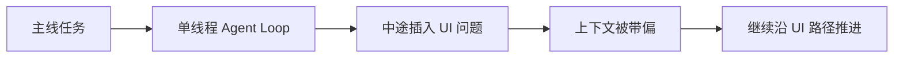
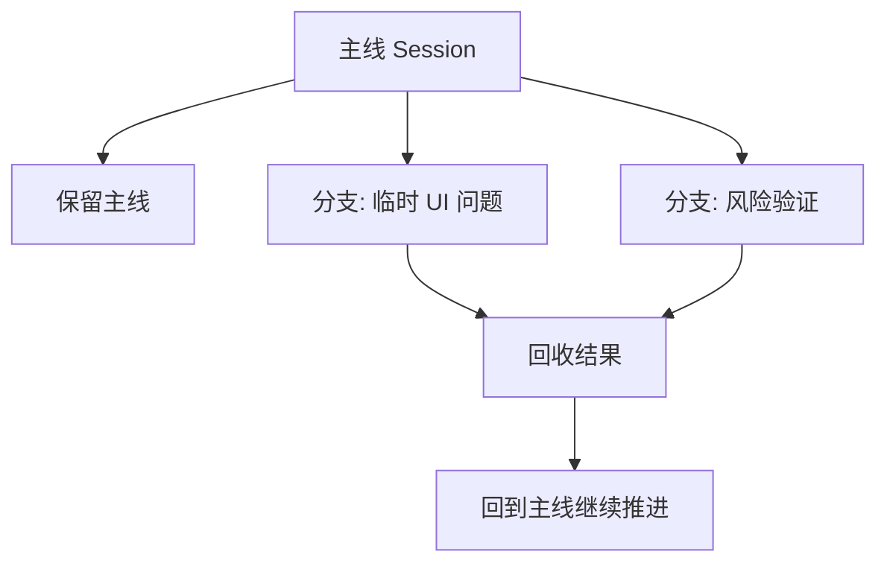
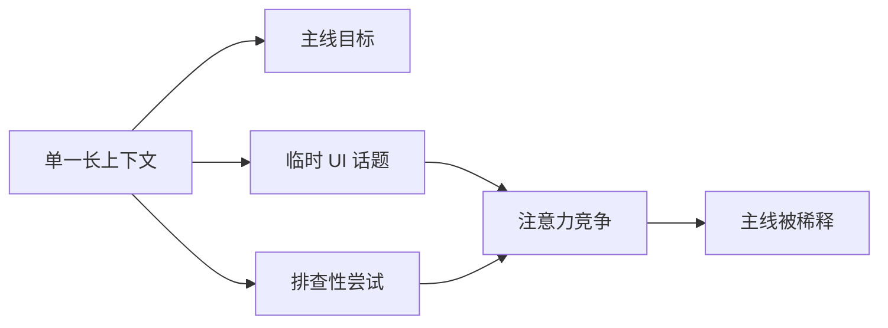
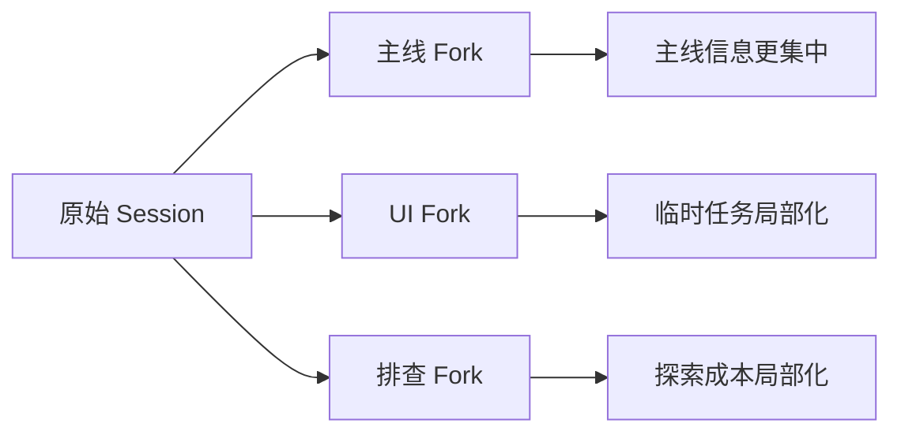
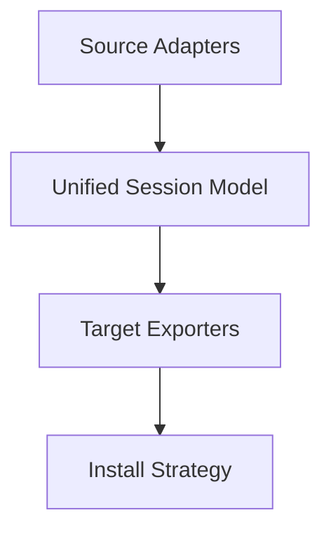

# KAGE：在 Codex、Claude 和 QoderCLI 之间 Fork 与迁移 Session

_本文组织结构：安装和功能案例 -> 两个真实需求 -> session / resume -> 实现 -> 未来_

能力：

- `KAGE` 可以把 `Codex`、`Claude`、`QoderCLI` 的本地 session 直接导成另一个 agent 可继续 `resume` 的原生 session。

- 自动探测当前目录下最相关的 session，在有多个候选时让你选择，并基于已有上下文直接 fork 一个新分支。

项目地址：
`https://github.com/farmcan/kage`

安装：

```bash
curl -fsSL https://raw.githubusercontent.com/farmcan/kage/main/install.sh | bash
```

如果只是想先试一下，最直接的命令是：

```bash
kage c2x  # Claude -> Codex，同工作目录下把 Claude 上下文接力到 Codex，支持按照 session 选择
kage x2c  # Codex -> Claude，同工作目录下把 Codex 上下文接力到 Claude
kage x2x  # Codex -> Codex，把当前 Codex session fork 成一个新分支
kage c2c  # Claude -> Claude，把当前 Claude session fork 成一个新分支
kage c    # 只列出当前目录下匹配的 Claude sessions
kage update  # 更新到最新版本
```

这里的缩写是：

- `c`: `claude`
- `x`: `codex`
- `q`: `qoder`

推荐测试：

```bash
# 同一个项目目录里，先连续跑两个 Claude session
claude 'a=100,b=200,a+b=?'
claude 'a=1,b=2,a+b=?'

# 然后执行迁移
kage c2x

# 最后执行它打印出来的 resume 命令
codex resume <session-id>
```

这一步通常会出现一个选择器，让你从当前目录下的 Claude session 里挑一个：

```text
➜  agentkit git:(fix/tool-history-early-errors) ✗ kage c2x
Multiple Claude sessions match the current directory:
[1] a=100,b=200,a+b=?
    Updated: 2026-03-22T14:49:54.695Z
    Session: b3b958d7-4ac8-41c4-8660-7b7f654737c6
    Path: /Users/you/.claude/projects/-Users-you-wrksp-agentkit/b3b958d7-4ac8-41c4-8660-7b7f654737c6.jsonl
    Recent user messages:
    - a=100,b=200,a+b=?


[2] a=1,b=2,a+b=?
    Updated: 2026-03-22T14:49:13.552Z
    Session: a3ac68c7-76f4-44ef-a619-f04f19b49c83
    Path: /Users/you/.claude/projects/-Users-you-wrksp-agentkit/a3ac68c7-76f4-44ef-a619-f04f19b49c83.jsonl
    Recent user messages:
    - a=1,b=2,a+b=?


[3] 查看并了解当前代码
    Updated: 2026-03-20T13:26:27.783Z
    Session: 33d6decd-7776-4fba-b1d6-50b904c07010
    Path: /Users/you/.claude/projects/-Users-you-wrksp-agentkit/33d6decd-7776-4fba-b1d6-50b904c07010.jsonl
    Recent user messages:
    - 查看并了解当前代码

Select a session [1-3]: 1
/Users/you/.codex/sessions/2026/03/22/rollout-2026-03-22T14-49-54-695Z-b3b958d7-4ac8-41c4-8660-7b7f654737c6.jsonl
Run:
codex resume b3b958d7-4ac8-41c4-8660-7b7f654737c6

➜  agentkit git:(fix/tool-history-early-errors) ✗ codex resume b3b958d7-4ac8-41c4-8660-7b7f654737c6
› a+b=?
```

如果这一步能直接在 Codex 里继续同一个问题，说明这条 `Claude -> Codex` 的接力链路是通的。

注：qodercli 目前没有显示支持 resume，所以 -> qoder 暂时不通。但是运行 `kage c2q` 仍然会生成 qoder 可识别的一对原生文件：`<session-id>.jsonl` 和 `<session-id>-session.json`，可以直接交给 qodercli 继续分析。—— 已经在社区提了 request，相信 qodercli 会跟进的。

---

**正文由此开始**

---

因为工作和个人兴趣的关系，我平时会混着用 `Claude`、`Codex`、`QoderCLI` 和其他 coding agent CLI 产品。

慢慢地，我发现自己反复遇到以下两种需求。

## 1. 背景：两个具体需求

### 1.1 多种 agent 的混用，需要上下文接力

这种混用不是为了比较工具，而是现实工作流本来就会这样：

- 某个 agent 在当前这一步更顺手
- token / 配额限制到了，不得不中途换工具
- 当前工作场景或环境限制，让我更适合切到另一个 agent 继续做

所以我需要一种能力：把同一个任务的工作上下文，从一个 agent 迁到另一个 agent，继续做下去，而不是重新解释一遍。

### 1.2 插入需求导致注意力偏移，所以需要显式分身

一个很真实的场景是：主线任务明明已经推进到一半了，但开发过程中总会突然冒出一个支线点子，如果不让 agent 当场去实现，我自己后面很可能就忘了。

比如主线本来是在做一个导入功能，重点是导入流程、字段校验和错误提示。  
做到一半，我突然想到导入页的 UI 也应该顺手调一下，比如按钮文案、间距、交互反馈。

这时候如果我直接在同一个 session 里让 agent 去做这件事，问题往往不是“它做不出来”，而是做完以后，它的注意力就会继续沿着 UI 这条线往前走。  
原本更重要的主线，比如导入流程、校验规则、错误处理，反而容易被稀释掉。

今天很多 agent 仍然是一个典型的单线程 `agent loop`：拿到当前目标，沿着一条上下文链往前推进。  
这和真实软件工程天然并行、天然会分支的工作方式其实是冲突的。

所以这里我真正需要的，其实不是“再让 agent 自己判断一下要不要开 subagent”，而是一个显式的 fork。  
至少在我现在的使用体验里，很多 subagent 机制仍然偏后台、偏自动委派，用户插入一个新需求之后，默认还是会回到同一个 agent loop，而不会天然被识别成“这是一个非主线分支需求”。

## 1.3 到最后，我真正需要的是“分身”和“接力”

到最后，我发现自己真正缺的其实不是一个更强的 agent，而是两种能力：

- `分身`
- `接力`

技术定义里再解释：

- `分身 = fork existing context`
- `接力 = move the same working context across agents`

`KAGE` 本质上不是“聊天记录转换器”，而是在做一件更工程化的事：

把不同 agent 的 session 读出来，整理成一个统一的工作上下文模型，再导出成目标 agent 能继续使用的原生 session。

CLI 我给它取名叫 `KAGE`，命令是 `kage`，借了“火影忍者多重影分身”的意象。  
这个名字背后的意思很直接：更好的 agent，不该只会沿着一条上下文链往前冲，而应该能把当前工作记忆复制成多个分支去并行推进。

## 2. 什么是 agent session

对 coding agent 来说，`session` 更接近一份本地持久化的工作状态，而不只是消息历史。

从我现在看到的几家实现看，session 至少会承载这几类信息：

- 会话 id 和时间信息
- 当前工作目录，或者项目标识
- 按时间推进的消息流
- 一些辅助恢复的元数据或统计信息

真正让“分身”和“接力”成立的，也不是一段普通 transcript，而是这层可继续、可恢复、可转译的工作状态。

也正因为如此，session 才能成为“分身”和“接力”的基本单位。  
如果没有这一层，剩下的就只是一段需要人工重新解释的聊天记录。

## 3. 三个真实的最小 session 例子

为了把这层背景说得更直观，我分别在三个 agent 里都跑了同一个最小问题：

`a=1, b=2. answer only: a+b=?`

下面这些片段都来自我本地真实生成的 session 文件，只对绝对路径和部分 id 做了脱敏。

### 3.1 `Codex`

`Codex` 的 session 会同时记录元数据、消息和事件，所以看起来最像“事件日志”。

```json
{"timestamp":"2026-03-22T13:59:13.431Z","type":"session_meta","payload":{"id":"019d15d7-b28d-7c02-9800-1dac42898d5b","timestamp":"2026-03-22T13:59:10.742Z","cwd":"/path/to/project","originator":"codex_exec","cli_version":"0.111.0","source":"exec","model_provider":"openai","base_instructions":{"text":"..."}}}
{"timestamp":"2026-03-22T13:59:13.431Z","type":"response_item","payload":{"type":"message","role":"user","content":[{"type":"input_text","text":"a=1, b=2. answer only: a+b=?"}]}}
{"timestamp":"2026-03-22T13:59:13.431Z","type":"event_msg","payload":{"type":"user_message","message":"a=1, b=2. answer only: a+b=?","images":[],"local_images":[],"text_elements":[]}}
{"timestamp":"2026-03-22T13:59:17.920Z","type":"response_item","payload":{"type":"message","role":"assistant","content":[{"type":"output_text","text":"I’m checking the required local skill instructions first, then I’ll answer the arithmetic directly."}],"phase":"commentary"}}
```

- `session_meta`: 会话入口，里面有 `id`、`cwd`、`cli_version`、`base_instructions`
- `response_item`: 真正的消息内容，用户和助手消息都在这里
- `event_msg`: 事件层记录，比如 `user_message`
- `phase:"commentary"`: 说明助手消息不只有最终答案，还会区分中间阶段

### 3.2 `Claude`

`Claude` 的 transcript 更像一条消息链。  
同一个问题里，除了 `user` / `assistant`，还会出现一些辅助记录行，比如 `queue-operation` 和 `last-prompt`。

```json
{"type":"queue-operation","operation":"enqueue","timestamp":"2026-03-22T13:59:09.188Z","sessionId":"40d61b17-f099-4c13-ab0d-88b4036e84e6","content":"a=1, b=2. answer only: a+b=?"}
{"parentUuid":null,"isSidechain":false,"promptId":"992a51e5-1854-4e2d-bfc9-e2488dd34290","type":"user","message":{"role":"user","content":"a=1, b=2. answer only: a+b=?"},"uuid":"f545bb93-4101-4c47-a5fd-b31f83ffb405","timestamp":"2026-03-22T13:59:09.225Z","cwd":"/path/to/project","sessionId":"40d61b17-f099-4c13-ab0d-88b4036e84e6","version":"2.1.79"}
{"parentUuid":"f545bb93-4101-4c47-a5fd-b31f83ffb405","isSidechain":false,"message":{"model":"qwen3.5-plus","id":"msg_99d93489-9ea3-41f9-ba76-42fdeff3f194","role":"assistant","type":"message","content":[{"type":"text","text":"3"}],"stop_reason":"end_turn"},"type":"assistant","uuid":"041f9794-dbdc-4f20-886b-8444d6d61450","timestamp":"2026-03-22T13:59:13.275Z","cwd":"/path/to/project","sessionId":"40d61b17-f099-4c13-ab0d-88b4036e84e6","version":"2.1.79"}
{"type":"last-prompt","lastPrompt":"a=1, b=2. answer only: a+b=?","sessionId":"40d61b17-f099-4c13-ab0d-88b4036e84e6"}
```

- `queue-operation`: CLI 进入处理队列的辅助记录
- `parentUuid`: 消息链关系，表示这条消息接在哪一条后面
- `cwd` / `sessionId`: 每条消息自己携带工作目录和会话 id
- `last-prompt`: 额外保存最近一次用户输入

### 3.3 `Qoder`

`Qoder` 是双文件结构：消息流在 `jsonl`，会话元数据在 `-session.json`。

`jsonl`：

```json
{"uuid":"3365c278-49d2-454d-a58e-8e946ecfc814","parentUuid":"","isSidechain":false,"userType":"external","cwd":"/path/to/project","sessionId":"565c96b2-7c51-4039-bf09-c3cfc4cdbe8d","version":"0.1.33","agentId":"4b847c37","type":"user","timestamp":"2026-03-22T13:59:09.605Z","message":{"role":"user","content":[{"type":"text","text":"a=1, b=2. answer only: a+b=?"}],"id":"cacad1bf-db8a-4b18-b63b-69c426eb096f"},"isMeta":false}
{"uuid":"06aa034f-69e8-4eaf-9d80-236a9c7d5688","parentUuid":"cacad1bf-db8a-4b18-b63b-69c426eb096f","isSidechain":false,"userType":"external","cwd":"/path/to/project","sessionId":"565c96b2-7c51-4039-bf09-c3cfc4cdbe8d","version":"0.1.33","agentId":"4b847c37","type":"assistant","timestamp":"2026-03-22T13:59:09.615Z","message":{"role":"assistant","content":[{"type":"text","text":"a + b = 3"}],"id":"fd5fc7e3-bef5-4abe-bf25-16b4513e5b50"},"isMeta":false}
```

`-session.json`：

```json
{"id":"565c96b2-7c51-4039-bf09-c3cfc4cdbe8d","parent_session_id":"","title":"New Session","message_count":0,"prompt_tokens":0,"completion_tokens":0,"cost":0,"created_at":1774187949577,"updated_at":1774187951839,"working_dir":"/path/to/project","quest":false,"total_prompt_tokens":0,"total_completed_tokens":0,"total_cached_tokens":0,"total_model_call_times":1,"total_tool_call_times":0,"context_usage_ratio":0.07813888888888888}
```

- `jsonl`: 真正的消息流，`user` / `assistant` 都在这里
- `parentUuid`: 同样承担消息链关系
- `agentId` / `userType`: 带出执行主体和来源
- `-session.json`: 放标题、工作目录、token/cost/call 统计这类 sidecar 元数据

## 4. `resume` 到底在恢复什么

做这个项目时，我最关心的一个问题就是：各家说的 `resume`，到底恢复的是什么？

结论：

- 它恢复的是“可继续的工作记忆”
- 而不是完整恢复一个仍在运行的 agent 进程

这个判断一半来自本地真实 session 文件，一半来自 `Codex` 的开源代码分析⬇️

如果只看 `Codex`，它的实现其实已经比较清楚了，大致可以拆成三层。

### 4.1 命令入口

`codex resume` 不是直接在基础命令上暴露一个公开 flag，而是顶层子命令把参数转成内部控制字段，再交给 TUI。  
在 `codex-rs/tui/src/cli.rs` 里能看到这些字段：

- `resume_picker`
- `resume_last`
- `resume_session_id`
- `resume_show_all`

也就是说，`codex resume` 至少支持三种入口：

- 打开 picker 让用户选
- 恢复最近一次 session
- 按 `session id` 直接恢复

对应源码：

- `tui/src/cli.rs`  
  https://github.com/openai/codex/blob/dcc4d7b634e0c732e5dab9ab04b6f3b67bfa55f1/codex-rs/tui/src/cli.rs
- `tui/src/lib.rs`  
  https://github.com/openai/codex/blob/dcc4d7b634e0c732e5dab9ab04b6f3b67bfa55f1/codex-rs/tui/src/lib.rs

### 4.2 索引和选择

这里不只是“扫一遍 `~/.codex/sessions`”。`Codex` 还维护了一层额外索引：

- 本地完整会话保存在 `~/.codex/sessions/...` 下
- `~/.codex/session_index.jsonl` 提供 thread id、thread name、updated_at 这类索引信息
- `~/.codex/history.jsonl` 提供了跨 session 的轻量文本历史

`codex-rs/core/src/rollout/session_index.rs` 里能看到，这个索引文件本身是 append-only 的，查询时会从文件尾部往前扫，取最新一条匹配记录。  
所以 `resume by name` 和 `resume by id` 用的都不是简单的“全目录最新文件”，而是“索引里的最新有效映射”。

`codex-rs/tui/src/resume_picker.rs` 则对应交互式 picker。这里还能看到一些更具体的产品设计：

- picker 默认按 provider 过滤
- 默认按当前工作目录过滤
- `--all` 才会取消 cwd 过滤
- 列表本身是分页加载的，不是一次性把所有 session 全读进来

对应源码：

- `core/src/rollout/session_index.rs`  
  https://github.com/openai/codex/blob/dcc4d7b634e0c732e5dab9ab04b6f3b67bfa55f1/codex-rs/core/src/rollout/session_index.rs
- `tui/src/resume_picker.rs`  
  https://github.com/openai/codex/blob/dcc4d7b634e0c732e5dab9ab04b6f3b67bfa55f1/codex-rs/tui/src/resume_picker.rs

### 4.3 真正的恢复

这一层不在 TUI，而在 app-server 的 `thread/resume` 实现里。  
在协议定义里，`ThreadResumeParams` 明确写了有三种恢复来源：

- `thread_id`
- `history`
- `path`

而且优先级是：

- `history > path > thread_id`

这点在 `codex-rs/app-server/src/codex_message_processor.rs` 里也能对上：

- `resume_thread_from_history(...)`
- `resume_thread_from_rollout(...)`
- `load_thread_from_resume_source_or_send_internal(...)`

具体来说：

- 如果给的是 `thread_id`，它会先去找 rollout 路径，再从磁盘加载 rollout history
- 如果给的是 `path`，就直接按这个 rollout 文件恢复
- 如果给的是 `history`，就直接用内存里的历史构造 resumed / forked thread

所以 `resume` 不是简单地“把旧 transcript 打开”，而是把 rollout history 重新装配成一个可继续的 thread 对象，并把 `turns`、`preview`、`path`、`cwd` 这些状态重新挂回去。

这也是为什么官方 schema 里会特别写：

- `thread/resume`
- `thread/fork`
- `thread/read`

这些接口返回的 `Thread` / `Turn` 才会带上恢复所需的历史项，而不是所有场景都默认带完整 turns。

对应源码：

- `app-server/src/codex_message_processor.rs`  
  https://github.com/openai/codex/blob/dcc4d7b634e0c732e5dab9ab04b6f3b67bfa55f1/codex-rs/app-server/src/codex_message_processor.rs
- `app-server-protocol ... ThreadResumeParams`  
  https://github.com/openai/codex/blob/dcc4d7b634e0c732e5dab9ab04b6f3b67bfa55f1/codex-rs/app-server-protocol/schema/json/codex_app_server_protocol.v2.schemas.json
- `docs/tui-chat-composer.md`  
  https://github.com/openai/codex/blob/dcc4d7b634e0c732e5dab9ab04b6f3b67bfa55f1/docs/tui-chat-composer.md

前面的最小样例，刚好可以帮助理解这里的差异。而在后续的实现中，也利用了这种思路，支持按需选择 session。

## 5. “分身”和“接力”各自为什么有效

把这两个需求分开之后，很多事情会更清楚。

### 5.1 分身的原理

分身解决的，本质上是“把同一个 agent loop 里的注意力竞争拆开”。

在一个长上下文里，主线目标、临时岔路、排查尝试、顺手改动，都会同时挤在同一个上下文窗口里。  
从模型角度看，这些信息会竞争注意力；从工程角度看，这些信息会竞争主线。

所以分身真正做的事，不是“复制一段聊天”。

它做的是：

- 保留当前已经形成的工作记忆
- 把某个新方向单独拆出去
- 让这个方向在自己的上下文里继续增长

这样主线和支线就不再互相污染。

### 5.2 接力的原理

接力解决的，则是“同一个任务跨 agent 续上”的问题。

这件事的关键并不是模型切换本身，而是如何把以下内容一起带过去：

- 当前任务到底做到哪了
- 这个任务发生在哪个工作目录
- 哪些消息仍然构成有效上下文
- 下一个 agent 应该从什么状态继续理解这个任务

所以接力真正做的，不是“导出一份聊天记录给另一个 agent 看”。

它做的是：

- 把源 agent 的 session 读出来
- 提取成统一工作记忆
- 再写成目标 agent 自己认得的 session

如果这个过程成立，接力就会很自然。  
否则你得到的只是一段需要人工重新解释的 transcript。





## 6. fork 对大模型和 agent 特别有效

如果只从产品直觉看，fork 很像“把对话复制一份”。  
但从大模型和 agent 的工作方式来看，它其实会直接改善上下文竞争问题。

先说大模型。

今天主流 LLM 基本都建立在 Transformer 之上，而 Transformer 的核心机制就是 attention。  
模型不是把上下文当成一个完全平坦的缓存区来读取，而是在生成当前 token 时，对上下文中不同位置分配不同权重。

这带来一个很重要的工程后果：

- 上下文越长，不同信息之间的竞争越强
- 不是所有历史内容都会被同等稳定地利用
- 任务意图一旦被新的话题稀释，模型后续更容易围绕更新、更近、或者形式上更显眼的信息继续生成

这并不等于“模型记不住”，而是说上下文利用本来就是有偏差、有选择的。

这一点在长上下文研究里已经很明显了。  
像 *Lost in the Middle* 这类工作表明，模型对长上下文里的信息使用，并不是均匀稳定的；中间位置的信息尤其容易被弱化。

这就能解释一个很常见的现象：

- 原任务明明还在上下文里
- 临时插入的问题也已经解决了
- 但后续生成还是更容易顺着新插入的话题继续走

因为从模型角度看，那条新话题已经改变了“当前最活跃的上下文分布”。

再说 agent。

很多 coding agent 的外层其实都可以理解为一种 loop：

1. 读取当前上下文
2. 生成下一步思考或动作
3. 把新的消息、结果、观察继续压回上下文
4. 再进入下一轮

像 *ReAct* 这样的工作，已经把这种“reasoning + acting interleaved”模式描述得很清楚了。  
它的优势很强，但副作用也明显：当前 loop 的状态高度依赖“最近被压进上下文的东西”。

所以 fork 的有效性，不只是交互层面的方便，而是有明确的技术原因。

我的判断是：

- fork 有效，不是因为模型突然更聪明了
- 而是因为它减少了无关上下文竞争
- 让当前分支里的目标、约束、近期决策和工作记忆更集中

换句话说，fork 做的是“上下文隔离”。

对人类工程师来说，这很像：

- 主线工作保留在原分支
- 临时问题放进新分支
- 风险探索放进另一个新分支

对 agent 来说，这同样成立。  
只不过它隔离的不是 Git 提交，而是下一轮生成时要参与竞争的工作上下文。





## 7. 统一模型是这个项目里最关键的一层

这个项目内部真正重要的，不是某个格式转换函数，而是中间那层统一模型。

我把不同 source 先整理成一个共同结构，核心只保留这些字段：

- `agent`
- `sessionPath`
- `sessionId`
- `cwd`
- `title`
- `updatedAt`
- `messages`

这样做的意义很直接：

- source adapter 只负责“读懂自己的格式”
- target exporter 只负责“写出目标格式”
- 中间层不关心源和目标具体是谁

这就把问题拆开了。

你要新增一个 source，只需要解决“怎么读”；  
你要新增一个 target，只需要解决“怎么写”。



## 8. 大致实现思路

整个实现可以分成四层。

### 8.1 Source adapters

这一层负责三件事：

- 发现本地 session 在哪里
- 找出和当前工作目录最相关的 session
- 解析原始格式，提取出统一模型

这里最重要的一点不是“找最新文件”，而是“找和当前目录真正匹配的 session”。  
否则同一个人同一天开了很多会话，很容易拿错。

所以项目里做的不是简单的 latest，而是：

- 先按当前工作目录匹配
- 如果命中多个，就让用户选
- 如果是非交互环境，就要求显式传 `--session-id`

### 8.2 Session transforms

这一层负责 fork 和 split。

它不碰目标格式，只处理统一模型：

- `split-recent`：裁掉旧上下文，只保留最近若干轮真实用户任务
- `fork`：在当前上下文上追加一个新的用户 prompt

本质上，这就是把“从已有工作记忆复制出一个新分支”这件事正式化。

### 8.3 Target exporters

这一层负责把统一模型写成目标 agent 的原生 session。

例如：

- 写成 `Codex` 能识别的 `session_meta + message rows`
- 写成 `Claude` 能识别的 `jsonl` transcript
- 写成 `Qoder` 需要的 `jsonl + sidecar`

目标不是“长得像”，而是“尽量让目标 agent 真正接得住”。

### 8.4 Install strategy

最后一层负责决定文件写到哪里。

如果目标是支持 resume 的 agent，就直接落到它默认查找的目录：

- `Codex` 写到 `~/.codex/sessions/YYYY/MM/DD/...`
- `Claude` 写到 `~/.claude/projects/<project-key>/...`

这样导出完以后，就不只是“拿到一个文件”，而是可以直接继续：

- `codex resume <session-id>`
- `claude --resume <session-id>`

而像 `Qoder` 目前还没有稳定的 resume 能力，就先导出为原生格式文件，等它后续支持。

## 9. 官方和社区其实都已经在补这块，只是切口不同

我做这个项目之前，也查过现在有没有现成东西已经把这件事做完了。

结论是：有相邻方向，但还没有一个我满意的组合。

官方这边已经做了很多：

- `Claude` 和 `Qoder` 在做 subagent
- `Codex` 和其他 agent 产品在做 parallel agent / background agent / worktree

这说明“单线程 agent 不够用”已经是行业共识了。  
但这些能力基本都发生在各自产品内部，还不是“跨 agent 的 native session bridge”。

社区里也能看到一些相邻项目：

- 有的在做 Claude session 管理
- 有的在做 transcript 提取
- 有的在做多 agent 可视化面板

但我还没看到一个工具，刚好把这三件事同时做顺：

- 读取本地原生 session
- 在不同 agent 之间转成原生可继续的 session
- 把既有 session 直接 fork 成新的工作分支

所以这个项目真正补的空白，不是“第一个意识到 agent 要并行化”，而是：

把 session 当成一个可以被读取、复制、转译、恢复的工程单元。

## 10. 顺着看一下各家现在的“分身路线”

把核心背景讲清楚以后，再看现在各家的产品设计，会发现大家其实都已经意识到单线程不够用了。

我自己的观察是，当前大致有三条路线。

### 10.1 `Claude` / `Qoder` 这类的 subagent

这条路线更像“角色化委派”。

`Claude Code` 已经有比较完整的 subagent 体系。官方文档里明确写了：

- Claude 会根据 subagent 的描述和当前请求决定是否委派
- subagent 默认是独立上下文
- 可以 resume 一个已有 subagent
- 但每次新的 subagent invocation，本质上仍然是 fresh context

`Qoder` 也已经走到这一步了：

- 可以隐式调用 subagent
- 也可以链式调用多个 subagent
- 还可以限制执行轮数

这条路线的优点很明显：

- 任务边界清晰
- 权限可以隔离
- 主线对话不会被所有中间细节淹没

但它更像“找一个专长角色去做事”，还不是“从当前自己完整的工作记忆复制出一个长期分支”。

### 10.2 `Codex` 这类的并行 agent

这条路线更像“工程化并发”。

`OpenAI` 现在公开强调的是 multiple agents in parallel、separate threads、built-in worktrees、long-running tasks。其他 coding agent 产品也在探索类似方向：独立环境、独立 branch、异步推进。

这已经很接近真正的多线程工程系统了。  
它的重点不是“一个 agent 更强”，而是“多个 agent 能同时干活”。

### 10.3 session fork

这一条恰好是我更关心的。

因为它解决的是一个很具体的问题：

- 我并不是每次都要从零叫一个新 agent
- 我只是想把当前已经形成的工作记忆复制一份
- 然后沿着另一个方向继续做

所以我会把这三条路线理解成不同层次的分身能力：

- `subagent` 更像“叫一个专长助手”
- `parallel agent` 更像“开一条真正独立的执行线程”
- `session fork` 更像“把我现在的工作记忆复制成一个新自己”

这三件事不是互斥的。  
恰恰相反，我觉得未来它们会合在一起。

## 11. fork 和 subagent 的差别到底在哪

我不觉得这两者是谁替代谁。

更准确的说法应该是：

- subagent 解决的是“局部任务委派”
- fork 解决的是“主线工作记忆复制”

这两个动作看起来接近，但工程意义不一样。

举个最实际的区别：

- 如果我想让一个 agent 去独立做 code review，那很适合 subagent
- 如果我正在一个复杂功能里推进，突然想插入一个 UI 岔路，但又不想丢掉当前主线，那更适合 fork

所以我后来越来越觉得，fork 是比 subagent 更底层的一块基础设施。  
因为无论以后 subagent 做得多聪明，session 作为“可复制工作记忆单元”这件事，仍然会存在。

## 12. 未来的 agent 更像分身系统，而不是更强的单兵

如果把今天的大多数 coding agent 看成一个单线程开发者，那么更合理的下一步，不是只让它“更会写代码”，而是让它更会管理上下文。

我更看好的方向是：

- 能识别主线任务和临时支线
- 能主动建议“这个问题最好单独开分支”
- 能把一个上下文复制成多个任务分身并行推进
- 能在最后把结果带回主线

如果要打一个直观的比方，我觉得未来的 agent 更像 Naruto 的影分身：

- 不把全部注意力押在一个主线程上
- 而是能复制当前工作记忆
- 派出几个分身去不同方向推进
- 再把结果回收到主线

在这个视角下，fork 就不是一个方便功能，而是 agent 从“单线程助手”走向“工程系统”的基础能力。

在这个视角下，这个项目做的也不只是几个方向上的 session 互转。更底层的一点是：agent 的 session 文件，以及围绕它的一整套工程化能力，后面只会越来越重要。

## 13. 当前边界

这个项目目前保留和传递的是可见上下文，不是完整运行时。

它保留的是：

- 任务语义
- 消息历史
- 工作目录
- 基本会话元数据

它不保留的是：

- 隐藏推理
- 工具运行时状态
- UI 状态
- 某些 agent 的内部执行现场

所以它更像是在接力“工作记忆”，而不是完整接管一个正在运行的 agent 进程。

这也是我觉得它现在最合适的定位：

不是神奇魔法，而是一个实用的 session bridge，也是一个关于 agent session 应该如何被看待、如何被工程化的实验。

## 14. References

- Vaswani et al. *Attention Is All You Need*. 2017. https://arxiv.org/abs/1706.03762
- Liu et al. *Lost in the Middle: How Language Models Use Long Contexts*. 2023. https://arxiv.org/abs/2307.03172
- Yao et al. *ReAct: Synergizing Reasoning and Acting in Language Models*. 2023. https://arxiv.org/abs/2210.03629
- Anthropic. *Claude Code Subagents*. https://code.claude.com/docs/en/sub-agents
- Anthropic. *Claude Code CLI Reference*. https://docs.anthropic.com/en/docs/claude-code/cli-reference
- Anthropic. *Claude Code Hooks*. https://docs.anthropic.com/en/docs/claude-code/hooks
- Qoder. *Subagent*. https://docs.qoder.com/en/cli/user-guide/subagent
- OpenAI. *Introducing the Codex app*. https://openai.com/index/introducing-the-codex-app/
- OpenAI. *Introducing Codex*. https://openai.com/index/introducing-codex/
